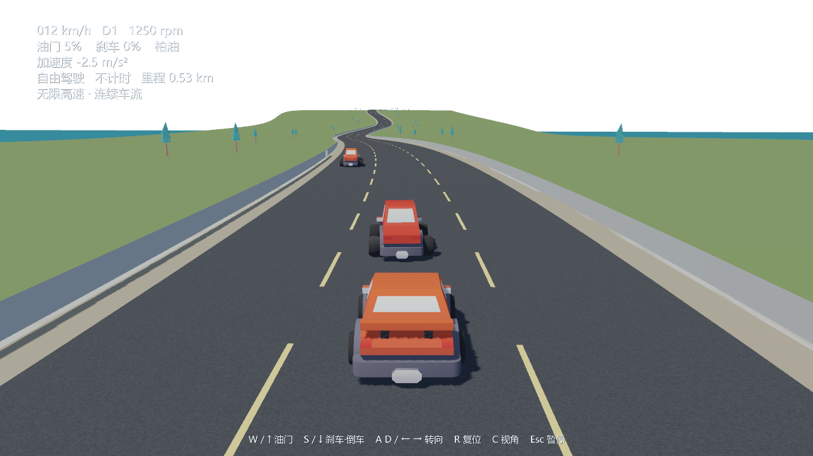

# CoastalDrive

后续实施入口：[更新版开发计划 V2](docs/development-plan.md)。当前为 5B 弯坡无限道路与 5C 车流行为预览；未完成门槛见[当前进度](docs/current-progress.md)。

Python/Panda3D 滨海驾驶游戏。当前包含可驾驶汽车、滨海计时挑战、自由驾驶和多车道高速原型。

公开仓库导读：先看 [当前进度](docs/current-progress.md) 和 [分阶段开发计划](docs/development-plan.md)；游戏入口在 [src/main.py](src/main.py)，物理与交通在 [src/simulation.py](src/simulation.py)、[src/vehicle.py](src/vehicle.py)、[src/highway_driver.py](src/highway_driver.py)，道路生成在 [src/highway_curve.py](src/highway_curve.py)。旧 MFC 工程的可读参考副本在 [legacy/ADAS](legacy/ADAS)，整理说明见 [legacy/README.md](legacy/README.md)。运行所需的 Kenney CC0 模型、纹理和许可在 `assets/game/`；原始素材压缩包、虚拟环境、日志和 Windows 打包文件不在 GitHub 仓库内。



当前已修复阶段 2 中停车后无法起步、转向单位/方向错误及轮胎接地问题。现在使用四轮 Bullet 车辆，阶段 3 已加入约 723 米的滨海环路、起步直道、上坡弯、S 弯、护栏和海面。H1 工程复测见 [H1-review.md](docs/H1-review.md)，地图说明见 [phase3-map.md](docs/phase3-map.md)，H2 修复与验收见 [H2-review.md](docs/H2-review.md)。

当前运行的是 **0.6.2 / 弯坡高速预览版**：轻点/持续按键有不同响应，渐进油门、扭矩曲线、自动换挡、松油减速、连续打轮/回正及镜头缓冲已接入。滨海环路支持计时、四个顺序检查点和最佳圈速；菜单可切换自由驾驶或三车道无限高速，并在高速中选择直路或弯坡路。高速交通会按净车距跟车、实体碰撞，并在远离玩家后确定性回收；R 复位会先检查交通占用。HUD 显示挡位、转速、实际加速度、圈速和检查点。本轮证据见 [H4B-curves-review.md](docs/H4B-curves-review.md)，车流行为见 [traffic-v2-review.md](docs/traffic-v2-review.md)，共享车辆复核见 [H4A-review.md](docs/H4A-review.md)，历史 H3 修复见 [H3-review.md](docs/H3-review.md)，物理参数取舍见 [vehicle-physics.md](docs/vehicle-physics.md)。

## 运行

使用项目 .venv 的 Python 3.14.2。原本的 B:\python.exe（3.12）无法正常启动，原因记录在 docs/phase0-environment.md。不要安装到全局 Python。

```powershell
.\.venv\Scripts\python.exe src/main.py
```

PyCharm 打开本项目，解释器选择 `.venv\Scripts\python.exe`，入口为 `src/main.py`。资源路径不依赖启动时的工作目录。

按 Enter 或点击“计时挑战”，三秒倒计时后按住 W / ↑ 起步。倒计时期间可提前按住油门。左上角显示速度、油门/刹车反馈、比赛时间和检查点；车辆停久后仍能正常起步。菜单中的“滨海自由驾驶”不计成绩；点“无限高速”后可选弯坡路预览或直路。默认12辆交通车，三类驾驶风格，会持续变速、超车后回归车道。后方逼近优先保持车速并择机让行，前方切入时减速；避让有反应时间和物理转向限制。

| 操作 | 按键 |
|---|---|
| 开始/继续驾驶 | Enter |
| 油门 | W / 上方向键 |
| 刹车，停车后保持进入倒车 | S / 下方向键 |
| 左右转向 | A/D / 左右方向键 |
| 就近回到路中并扶正 | R |
| 两档追尾距离 | C |
| 暂停/继续 | Esc |
| 诊断信息 | F3 |
| 切换主车车漆 | 主菜单“车漆”按钮 |

窗口失焦自动暂停，切回后按 Enter / Esc 继续。R 就近回到当前路段中心，沿道路方向扶正；“重新开始”才回到起点。S 先刹车，接近停稳后继续保持约 0.4 秒进入倒车。界面使用本机 Windows 微软雅黑，不把系统字体复制进素材包。计时挑战只有有效完圈才保存最佳成绩；复位会使本圈无效，暂停不计时；允许倒车调整，重复过点不会重复计数。

正式地图是一条有海面、上坡、护栏和连续弯道的滨海环路。当前比赛计时和检查点已经可用；无限高速已有实体护栏、交通碰撞、分段回收和坐标重定位，弯坡路处于预览。旧有限高速仍可通过 --track highway 运行。交通密度选择和 AI 驾驶模式尚未完成。地图目录、玩法规则和仿真状态已经分开，便于扩展而不改变现有驾驶手感。动力学回归使用独立测试世界，不在正式地图中放隐藏测试场。

在主菜单点击“车漆”按钮，主车可在原厂橙、海湾蓝、赛车红、松林绿、珍珠白之间切换；交通车从两款已有模型和五种车漆中按种子选择。车漆不改变性能，车灯、玻璃、轮胎保留原材质。本轮只提供基础换肤，详细车库、贴花和跨启动保存尚未加入。

## 检查

```powershell
.\.venv\Scripts\python.exe -m pytest -q
.\.venv\Scripts\python.exe -m ruff check src tests tools
.\.venv\Scripts\python.exe src/main.py --headless --steps 10000 --seed 17
.\.venv\Scripts\python.exe src/main.py --smoke --output logs/h0-offscreen
.\.venv\Scripts\python.exe src/main.py --smoke --track highway --output logs/stage4-highway-smoke
.\.venv\Scripts\python.exe src/main.py --window-smoke --output logs/h0-window
.\.venv\Scripts\python.exe tools/h0_ui_check.py
.\.venv\Scripts\python.exe tools/h1_ui_check.py
.\.venv\Scripts\python.exe tools/h1_benchmark.py
.\.venv\Scripts\python.exe tools/phase3_route_check.py
.\.venv\Scripts\python.exe tools/h2_render_check.py
.\.venv\Scripts\python.exe tools/stage4_ui_check.py
.\.venv\Scripts\python.exe tools/h3_ui_check.py
.\.venv\Scripts\python.exe tools/h2_render_check.py --output logs/h3-review/render
```

headless 不创建窗口或加载渲染模块；offscreen smoke 创建实际离屏渲染上下文，两者用途不同。

H1 的两项自然素材来自阶段 0 已下载的 Kenney CC0 包。需要重新准备时运行 `python tools/prepare_h1_assets.py`，它只复制测试场使用的树和岩石及其许可证。

## 打包

```powershell
.\.venv\Scripts\python.exe setup.py build_apps
```

默认输出为 `build/win_amd64/coastaldrive.exe` 和同目录资源。当前 **0.6.2** 独立版位于 `builds/0.6.2/win_amd64/coastaldrive.exe`。运行整个文件夹，不要只复制 exe。应用日志在 `%LOCALAPPDATA%\CoastalDrive`。

## 代码边界

- simulation：唯一权威状态、固定步长运动、种子、只读快照。
- controls：统一 Control 的键盘与脚本来源。
- session：120 Hz 调度、插值与菜单/暂停/重开生命周期。
- tracks：地图目录、玩法可切换入口、车道中心和行驶方向。
- coastal_map / highway_map：路线、路面/路肩/护栏/道路分段信息，供物理和显示共用。
- race：计时挑战、检查点、逆行/复位判定和分地图版本的最佳成绩保存。
- world_props：树、岩石、检查点框架的共同摆放与碰撞尺寸。
- vehicle_config / vehicle_dynamics：车辆参数、道路阻力、轴载荷估计和动力学诊断。
- skins：主车换漆与确定性的交通外观选择；不参与车辆受力。
- scene / application：模型、界面、相机与窗口；消费快照，允许只读场景查询。
- tests：正式实现的行为检查。

原 MFC 工程仍位于本项目外，保持只读。素材来源见 docs/asset-register.csv；下载与加工资源在 assets 下，未全部纳入 Git，需要保留现有资产目录。
