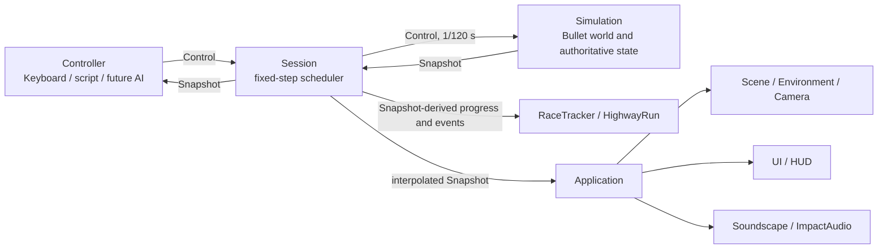
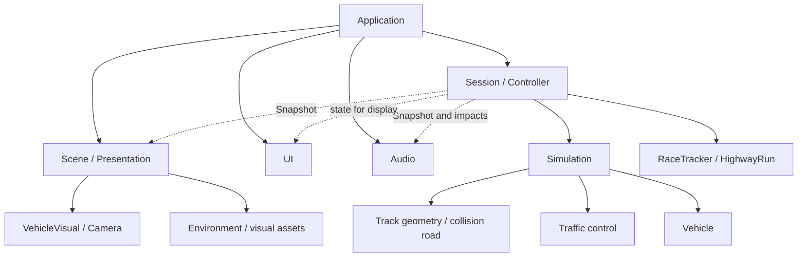

# CoastalDrive 架构地图

本文描述当前源码中的职责与主要数据流，方便新成员快速定位代码。代码是事实来源；本文不是新的分层规范，也不承诺尚未实现的功能。

## 系统目标

CoastalDrive 当前是一款可玩的驾驶游戏：固定步车辆仿真、NPC 交通、滨海/高速/测试路线，以及计时赛和高速挑战。结构上已经有一条可替换驾驶输入、读取仿真快照的 `Controller` 边界，可供未来 AI 控制器接入；AI 训练、Gym 适配器和策略本身都尚未实现。

## 核心数据流

- `Control` 是转向、油门、制动输入值；键盘只是当前默认 `Controller`。`Controller.sample(snapshot, dt)` 读取只读状态并返回输入，不直接操作 Panda3D 或 Bullet。
- `Simulation.step()` 只接受 `FIXED_DT = 1/120` 秒，推进车辆、交通、碰撞与道路流送；`Simulation.snapshot()` 返回冻结的 `Snapshot`，其中包含主车、交通车及事件数据。
- `Session` 用固定步调度器推进仿真，并保存前后快照供显示插值。它还运行赛道模式对应的玩法规则。游戏重置、暂停等命令由 Session 路由，不是方向盘 `Control` 的一部分。
- `Application` 每帧驱动 Session，再把显示快照送给场景、HUD 和声音。它负责程序装配、输入绑定、菜单/加载/页面生命周期与呈现协调，不是物理状态来源。

## 系统职责与源码地图

| 系统 | 当前职责 | 主要源码 |
|---|---|---|
| Application | Panda3D 程序入口后的对象装配、输入与页面流程、Gameplay Scene 的创建/释放、逐帧协调 | `src/main.py`、`src/application.py` |
| Session / Controller | 1/120 固定步调度、暂停/恢复/重赛、Controller 选择、状态插值、玩法 tracker 调用 | `src/session.py`、`src/controls.py` |
| Simulation | 唯一权威物理世界；主车与 NPC 刚体、交通控制推进、碰撞/撞击事实、路面碰撞体、重置与快照 | `src/simulation.py`、`src/vehicle.py`、`src/vehicle_state.py`、`src/impact_events.py` |
| Vehicle | 单车 Bullet 车体与车轮、车辆参数、动力学估算、转向/踏板/自动变速响应和状态采样 | `src/vehicle.py`、`src/vehicle_config.py`、`src/vehicle_dynamics.py`、`src/vehicle_response.py`、`src/vehicle_state.py` |
| Traffic | NPC 路线跟随、车道与间距控制、高速信号/策略、受撞后的恢复；NPC 物理车仍由 Simulation 持有 | `src/traffic.py`、`src/highway_driver.py`、`src/traffic_recovery.py` |
| World / Tracks | 赛道选择和几何；滨海道路、有限高速、弯坡道路、无限路段流送及静态道具 | `src/tracks.py`、`src/coastal_map.py`、`src/highway_map.py`、`src/highway_curve.py`、`src/highway_segments.py`、`src/streamed_road.py`、`src/world_props.py`、`src/test_track.py` |
| Gameplay | 计时赛检查点/成绩与无限高速距离/挑战结果；消费仿真快照，不拥有车辆物理状态 | `src/race.py`、`src/highway_run.py` |
| Presentation | 场景几何装配、道路和环境、车辆模型、镜头与天空；根据快照更新移动物体 | `src/scene.py`、`src/environment/`、`src/vehicle_visual.py`、`src/skins.py`、`src/chase_camera.py`、`src/sky_dome.py`、`src/garage.py` |
| UI | 主菜单、HUD、主题和驾驶/结果面板；展示传入的游戏状态 | `src/ui/main_menu.py`、`src/ui/hud.py`、`src/ui/theme.py`、`src/settings.py` |
| Audio | 引擎/路面氛围声与基于撞击事件、接触状态的声音反馈 | `src/soundscape.py`、`src/impact_audio.py`、`src/impact_events.py` |

无限高速由已有物理分段提供：`highway_segments.py` 定义分段，`streamed_road.py` 在 Simulation 的 Bullet 世界里装载/回收碰撞段；`scene.py` 负责对应的可见路段和环境资产。有限 `highway` 与无限 `endless` 是不同路线配置，不要把它们混为一个生成系统。

## 主要依赖方向

这是从当前调用和数据流提炼的主要方向，不是由容器或依赖注入框架强制的完整 import 图。关键约束是：Simulation 维护物理真相，不依赖 UI、Scene 或 Audio；Presentation、UI、Audio 可以读取快照或由 Application/Session 提供的数据，不能另存一份可与仿真冲突的车辆位置、速度或交通状态。场景可以读取道路定义来生成画面，但显示变换不回写到物理世界。

## 仓库目录职责

| 路径 | 用途 |
|---|---|
| `src/` | 游戏运行代码；输入、仿真、玩法、表现、UI 与声音。 |
| `art/` | 可继续编辑的 Blender 美术源文件和美术说明，如 `art/coastal/`、`art/expressway/`、`art/vehicles/`。 |
| `assets/game/` | 运行时加载的模型、贴图、天空、声音、字体和 UI 资源；游戏不要求运行 Blender。 |
| `assets/source/`、`assets/raw/` | 来源记录及保留的原始/第三方素材；是否进入运行包由具体资源清单决定。 |
| `tools/` | 离线资产构建/导出、烘焙、验证和性能采集工具；不是运行时架构层。 |
| `tests/` | 自动化单元、集成及赛道/视觉数据约束检查。 |
| `docs/` | 当前进度、任务边界、设计约定和可追溯证据；文档不能覆盖现役源码事实。 |

## 模块组织与演进

`src/ui/` 聚合页面控件和主题；`src/environment/` 聚合只读场景环境表现，二者都有清晰的内部边界。Vehicle、Traffic、Gameplay 和道路目前由若干小型平铺模块协作：例如车辆参数、动力学、响应和状态分别在独立文件中；交通行为和恢复也分开；规则 tracker 与地图/流送各自独立。当前职责仍可直接从这些模块定位，尚无因功能增长而必须再包一层目录的需求，因此保持现状比为形式一致而移动文件更准确。

当具体功能确实扩大或出现稳定的内聚边界时，再按那项功能调整组织；不要仅按文件长度拆分，也不要预先引入 Manager、Service、ECS、事件总线或依赖注入框架。

## Future AI 接入原则

未来驾驶策略应实现现有 `Controller` 协议：读取 `Snapshot`，在给定 `dt` 下返回 `Control`。因此策略可以与键盘使用同一 Session/Simulation 回路，且仿真仍是状态权威。不要通过模拟按键接入 AI，也不要在本文件所述的当前架构之外预造 AI 专用抽象；训练包装器、观测/动作扩展等需等具体训练需求明确后再设计。
