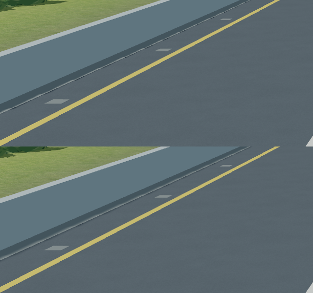

# 左侧路肩阴影过滤对照

2026-09-30。基线f9431dd+工作区PERF-02已有索引地形/采样缓存；本对照只有高速接收阴影函数不同。阴影关闭仅用于归因，不是交付配置。

[before.mp4](before.mp4)：原simplepbr单次硬件阴影比较；[after.mp4](after.mp4)：接收平面校正+3×3 PCF。两者都是1080p、seed23、hills、起点8m、相机每帧前进0.08m，24帧，物理冻结的离屏探针，不是游戏FPS，也不是用户实际驾驶。图中上方为之前，下方为之后：

可见左侧窄阴影边缘由细碎硬边变为连续柔和过渡；完整帧仍保留车辆、门架投影。直道与弯道另外各检查24帧，原始帧位于logs/HWY-03/pcf-straight、pcf-curves、pcf-moving、hard-shadow-moving。固定相机诊断remaining-static/pcf-static在首帧预热后都基本稳定，因此不能拿这组静态统计声称移动闪烁下降某个百分比。

T1：logs/HWY-03/T1-shadow-filter-final，Ruff/46项测试/三种子通过。第一轮T1因import格式失败后修正。统计脚本第一次尝试numpy因环境未安装失败，改用现有PNMImage读图，无额外安装。新增过滤的GPU代价还需PERF-02集成复核，未对用户观感做自动验收。

方法来源：

- [Microsoft：Common Techniques to Improve Shadow Depth Maps](https://learn.microsoft.com/en-us/windows/win32/dxtecharts/common-techniques-to-improve-shadow-depth-maps)，用深度冲突、阴影自遮挡、投影采样三类问题分开诊断，保留已有纹素对齐，限制偏移以避免阴影脱离物体。
- [NVIDIA GPU Gems：Shadow Map Antialiasing](https://developer.nvidia.com/gpugems/gpugems/part-ii-lighting-and-shadows/chapter-11-shadow-map-antialiasing)，采用邻域深度比较平均的PCF思路。这里按本项目选择固定3×3核，没有照搬其16次或屏幕抖动采样实现。

最新源码包含此修复；0.8.3-hwy03旧包不包含，后续PERF-02统一打包。
