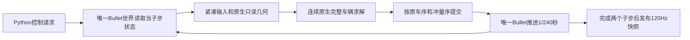

# 连续原生求解的实施边界与本轮检查点

2026-10-09；基线 main `00d4d8e`。状态 **in_progress**。用户要求学习成熟团队，随后提供 PhysX/BeamNG/Wube 等研究材料，并明确把完整原生车辆求解排在调度、数据包与多速率之前。本轮生产 `src/` 未改；没有完整原生求解器、没有实时120Hz通过结论。新增独立完整求解基准及一个隔离调度实验；实验未整合。不能把本报告或基准工具的完成记为物理任务完成。

## 根据原始资料修正路线

PhysX 5.1迁移文档推荐先集中运行车辆ActorBegin读取，再并行执行只计算车辆速度的组件序列，最后集中运行ActorEnd写回。原因之一是世界读写锁会把并行计算串行化。CoastalDrive现有读取→数值→有序提交总体边界可保留；应迁移中间计算及数据表示，保持唯一Bullet世界。PhysX的刚体/重力处理方式与本项目不同，不能复制其更新模式而造成重力重复或冲量缺失。[NVIDIA原文：Vehicle Update](https://nvidia-omniverse.github.io/PhysX/physx/5.1.0/docs/MigrationTo51.html)。

BeamNG官方架构区分2000Hz物理、可变图形和C++核心/Lua游戏逻辑；虚拟机文档还说明车辆Lua可以在物理或图形频率运行，并包含传动等附属计算。因此这支持高频核心与游戏层分离，不能据此声称其全部车辆传动都用C++，也不能用频率直接比较我们的模型成本。[架构](https://docs.beamng.com/beamng_tech/architecture/)、[车辆虚拟机](https://documentation.beamng.com/modding/programming/virtualmachines/)。

Wube的FFF421报告记录了电网多线程局部变快但整体无收益，并用VTune确认其案例受内存访问限制；它也通过停止无任务实体的反复更新获得收益。对本项目的借鉴是测量实际工作和整体吞吐、撤销无收益方案。本项目尚无内存带宽计数器证据，不能照搬其根因；驾驶中的13辆车全部执行现有高精度方程，不能按“无事可做”跳过物理。[Wube原文](https://www.factorio.com/blog/post/fff-421)。

顽皮狗的GDC2015演讲记录了系统大量任务化后仍受CPU关键路径限制，继而让游戏和渲染处理不同的数据帧，配合明确的缓冲生命周期。本项目应借鉴依赖链和数据所有权；不照搬完整fiber框架，也不并行推进互相依赖的两个物理子步。[演讲第49、55–71页](https://media.gdcvault.com/gdc2015/presentations/Gyrling_Christian_Parallelizing_The_Naughty.pdf)。

Box2D作者指出串行组织成本限制多核扩展，且并行改变约束顺序会改变顺序求解结果。因此先按车辆并行，保留单车四轮交替次序、活动分区访问顺序和Bullet提交顺序；SIMD/数学等价算法后续单独验证。[Simulation Islands](https://box2d.org/posts/2023/10/simulation-islands/)、[Determinism](https://box2d.org/posts/2024/08/determinism/)。

## 已有证据与本轮新增证据

前轮13车固定输入ABBA完整物理步15.671→17.308ms，批量屏障方案变慢，600拍完整快照一致。原240拍时间线中，接收墙钟6.851ms的5.688ms与实际远程求解重叠；剩下1.163ms包含调度、回复组织、传输等未分类因素。不得称其全为IPC。主世界推进、读取、观察、提交属于必须保持世界所有权的串行阶段；Python对象恢复/编码等是实现带来的串行成本，可迁移。阶段嵌套，不可直接相加。[原记录](../structural-20261009/comparison.json)、[时间线](../structural-20261009/costs-13-cycles.json)。

前轮有效前台短测13车43.813物理Hz/75.735绘制FPS，9车62.364Hz/103.734FPS；丢时分别17.167/12.942秒。独立权威进程原型分别49.579/67.848Hz，但绘制下降且仍丢时，未整合。它只证明隔离解释器竞争不能独自达到120Hz。日志`foreground-base-13-final`的`window_sampling_valid=false`，不得纳入有效前台比较。[原始有效报告](../structural-20261009/measurements/foreground-base-13/report.json)。

本轮流式共享槽实验保持逐车读完就投递、有界排队、原完整求解和原序提交，消除第10车投递前强制回收一个结果。13车600拍四次完整快照一致，队列峰值2。A1/A2均值19.604/16.632ms相差较大，B1/B2为15.998/15.905ms；不能取ABBA平均宣称稳定收益。首次128拍验证期间发现两份阴阳师新负载，已按用户外部负载授权停止；其后虽游戏进程消失，负载/温度和调频恢复仍可能影响早段A1。没有采集硬件计数器证明变化原因。用户进一步明确原生求解优先后，停止扩展此实验，无9车/前台新原型验收，不整合。

新增`benchmark_vehicle_solver.py`直接重算真实完整`TireAdvanceInput.solve`，含当前姿态接触准备、轮胎、悬架、传动、末状态与冲量组织，排除进程IPC；只用旧结果核对，绝不向物理轨迹重放结果。来自前轮13车两个子步的26份真实输入，8轮预热后40轮计时，共1040完整子步，结果全部逐字节相同。首次实测均值1.750ms/P95 2.165ms；profile另跑26次，未计入吞吐。固定输入重复数值基准不能代表移动长轨迹、长尾、其他硬件或完整物理Hz。[完整求解报告](single-solver-report.json)。

## 完整原生化必须跨过的边界

当前`TireAdvanceInput.solve`会建立Tires/Powertrain/Suspension数值对象；`advance_drivetrain`构造闭包、元组、缓存及分区表，驱动20轮共同收敛；内层曲轴/轴/轮共享状态上限30轮。C内核虽然已计算不少矩阵和局部求根，`wheel_map_values`/`wheel_force_state`仍在访问和改写Python暖启动列表，有限接触仍通过Python表面方法回调。当前扩展没有连续无PythonAPI计算区。只编译Python源码或套一层C++调度不等价于所需内核。

目标为一个完整`solve_vehicle_substep`数值边界：



这是目标架构，当前尚未实现。两个子步之间必须读取Bullet推进后的真实新姿态，不能把两个子步打包成互不依赖的26个任务。可批量的是**同一个子步中的多辆车**。

连续内核需共同迁移以下内容，不能把这些列项当作继续逐个测小函数的清单：

| 数值所有权 | 同一完整求解内应有的原生内容 |
|---|---|
| 不变硬件 | 当前完整车辆配置、前后胎差异、实体轴惯量/效率/限滑/材料参数；不替换为通用简化车 |
| 本子步输入 | 原Panda单精度刚体读数转换、四轮状态、胎体/压缩/传动历史、请求和真实外力速度 |
| 机械工作区 | 9/11维状态、SharedMap/WheelMap、分区表、暖模式整数数组、Newton/LU/线搜索暂存；避免PyObject暖模式 |
| 有限接触 | 原Box/Hull/真实三角网格、margin/资格/变换/顺序、胎肩/胎冠及末姿态共轭梯度；不能冻结首次接点代替迭代几何 |
| 完整收敛 | 20/30轮、轮力、制动、法向、1e-12几何冲量门槛、八维接触/六维悬架修正及原失败路径 |
| 输出 | 原序中央/轴/轮端冲量、接触和完整数值状态/能量账；禁止直接篡改刚体姿态或另建世界积分 |

持久工作区按车辆或正在执行的任务独占。每个子步重置力、历史、暖模式和迭代缓存，除原算法明确保留的真实车辆历史外，不借缓存引入新的跨子步暖启动。几何按实际版本更新，原生指针不能越过几何退役。容量不足应明确失败/由准备阶段扩容，不能静默裁掉接触候选。

Python只在输入/输出边界出现；内核内报错写入数值错误结构，退出后再构造Python异常。循环中不得调用PyErr、PyList、Python表面回调或分配Python数值对象。满足这一点之后才释放GIL并用持久原生线程池；线程数要通过整步实验选择，不预设核数越多越好。[CPython线程边界](https://docs.python.org/3.14/c-api/threads.html)。

保留现有唯一Bullet世界的读取/有序提交接口作为第一版桥接。若主世界串行部分仍使完整步超预算，再研究与当前Panda/Bullet二进制匹配的批量C++桥接；不能直接拿原生指针重解释ABI，也不能提前换物理引擎。初版不需要整个游戏改写C++、ECS、事件总线或Manager框架。

## 实施与停止条件

1. **第一实施块是完整单车连续原生求解**：以本轮独立真实输入入口作Python对照；必须覆盖当前完整机制及高负载联合修正，再讨论性能。只有固定线性悬架台架或固定初始接点的C核不算完成。已有C数值内部逻辑可复用，Python包装与几何回调需一起解除。
2. 检查独立残差、接触资格/切换、力矩/功和能量账，再跑真实车辆落地、弯坡、制动、边角/护栏等行为。先争取原序字节相同；数学等价导致末位不同必须按原残差和守恒要求独立验证，不能只放宽快照差异。原T2同拍收敛失败保留，不能以性能优化名义隐藏。
3. 单车完整求解没有稳定明显收益就停止扩大整合。若有收益，再在每子步批量数值入口接持久工作区/原生并行，验证9/13车完整步ABBA及相同负载下的尾部耗时。
4. 13车困难无限坡道完整步预算仍8.333ms；实际前台同时记录物理Hz、模拟推进、丢时、长帧和玩家/交通/相机位置。绘制FPS升高或单车更快都不能替代实时目标。未达到预算则保留原Python可对照路径，继续定位真实限制，不强行整合。
5. 多速率和NPC Simulation LOD暂不实施。前者需强耦合误差与稳定性证据；后者属于用户明确决定的模型取舍。当前仍120Hz、两个真实子步、全部车辆硬件/本构和同等NPC保真度。

## 复现与验证范围

```powershell
.venv/Scripts/python.exe tools/performance/benchmark_vehicle_solver.py --fixture docs/evidence/PHYS-PERF-01/structural-20261009/native-input-fixture --output logs/performance/job-20261009/single-new --profile
.venv/Scripts/python.exe tools/performance/prototypes/build_stream_prototype.py --output logs/performance/job-20261009/stream-new
.venv/Scripts/python.exe tools/performance/benchmark_physics.py --source logs/performance/job-20261009/stream-new/src --output logs/performance/job-20261009/stream-13-new --workers 9 --traffic 12 --mode simulation --traffic-input-mode game --track endless --shape hills --driver endurance --seed 23 --warmup 240 --steps 600 --capture-hashes
.venv/Scripts/python.exe tools/validate.py T1 --area workflow --output logs/performance/job-20261009/T1-new
```

首轮完整单车报告、四份完整物理原始报告和比较摘要归档；原始profile/完整hash序列在本机logs/performance/job-20261009。本轮工具T1只检查开发工具，不能代替车辆T1。生产物理没有修改，复用前轮未改范围的物理证据；本轮未跑完整T2/T3、未证明新前台收益、未完成用户驾驶/画面验收。新增文件与文档本地保存，不推送。
