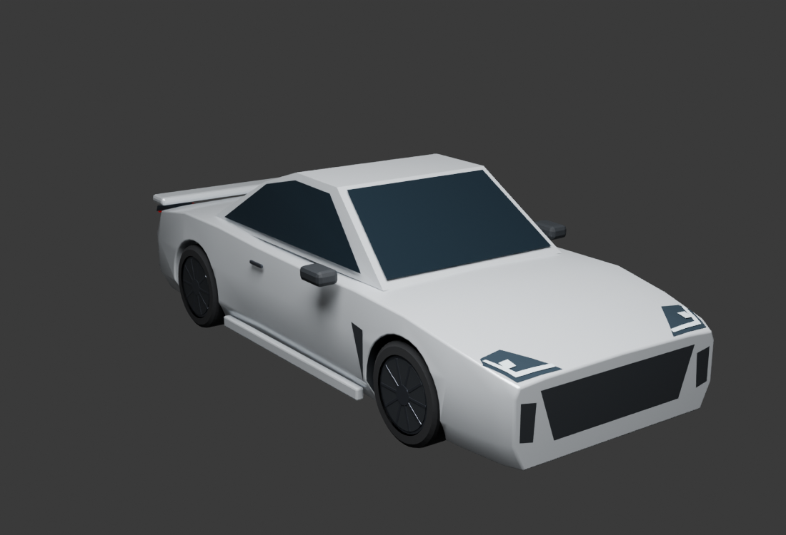
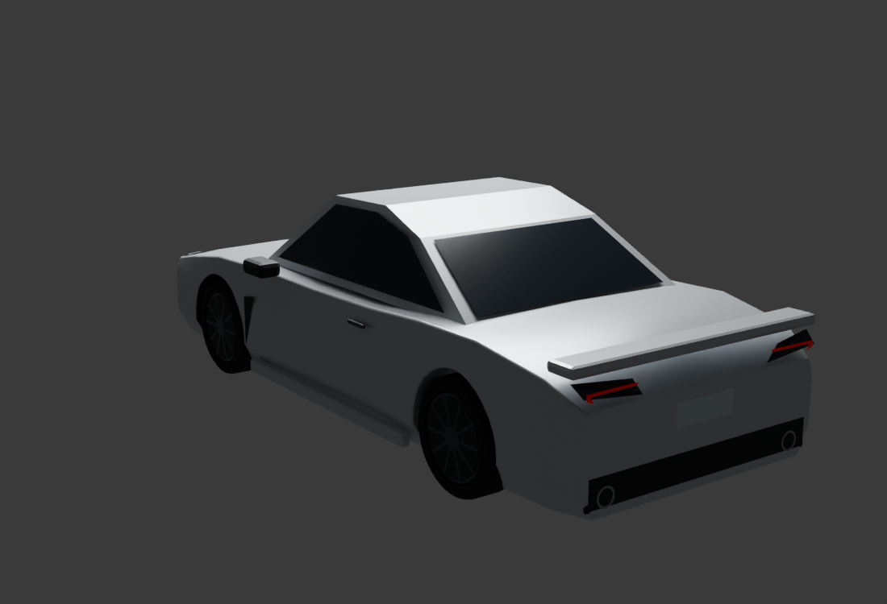

# GR86可编辑外观准备

[Blender源](appearance-draft/gr86_2022_premium_draft.blend)、[运行GLB](appearance-draft/gr86_2022_premium_draft.glb)、[生成脚本](appearance-draft/build-appearance-draft.py)、[导入读回脚本](appearance-draft/measure-appearance.py)已保存。原创近似低模根据已保存的2022原厂手册制作，当前只作首款实车准备，未接游戏、未进行车辆标定。

前灯原被实心车身遮住；灯片改为沿实际三角网格投影，前后视实图已核对前灯底壳、角进气、尾灯和双排气口。圆角后不含镜车身宽曾削窄10mm，恢复车身网格宽度后再次生成并用游戏同一Panda3D glTF导入器读回。四轮没有参与该调整。

| 读回项目 | 米 |
|---|---|
| 不含镜paint车身宽／长 | 1.77499998／4.26499987 |
| 完整含镜外观宽／长 | 2.02999997／4.26512003 |
| 车身低／高Z | .13／1.31 |
| 前／后轮中心横距 | 1.52／1.55 |
| 四轮胎宽／名义轮径 | .21500003／.62919998 |

完整外观长度包含灯片／排气表面的微小分离；原厂不含镜尺寸与完整外廓分别保存，接入时按对应部件装配。运行文件20网格、11748三角形；这是资产统计，不是运行性能通过结论。[完整尺寸、失败尝试和文件SHA](appearance-draft/receipt.json)。生成脚本的第一次网格贴合因三角化返回索引而失败，按当前Blender实际返回值修正后完成；r8失败日志保留。

后续：完善车型本体、按配置接轮位／外廓与材质，更新素材注册，在真实游戏窗口核对；两模式驾驶与最终Gate按施工线继续。当前主物理源码仍冻结在PHYS-DESIGN-01的T2运行版本。
